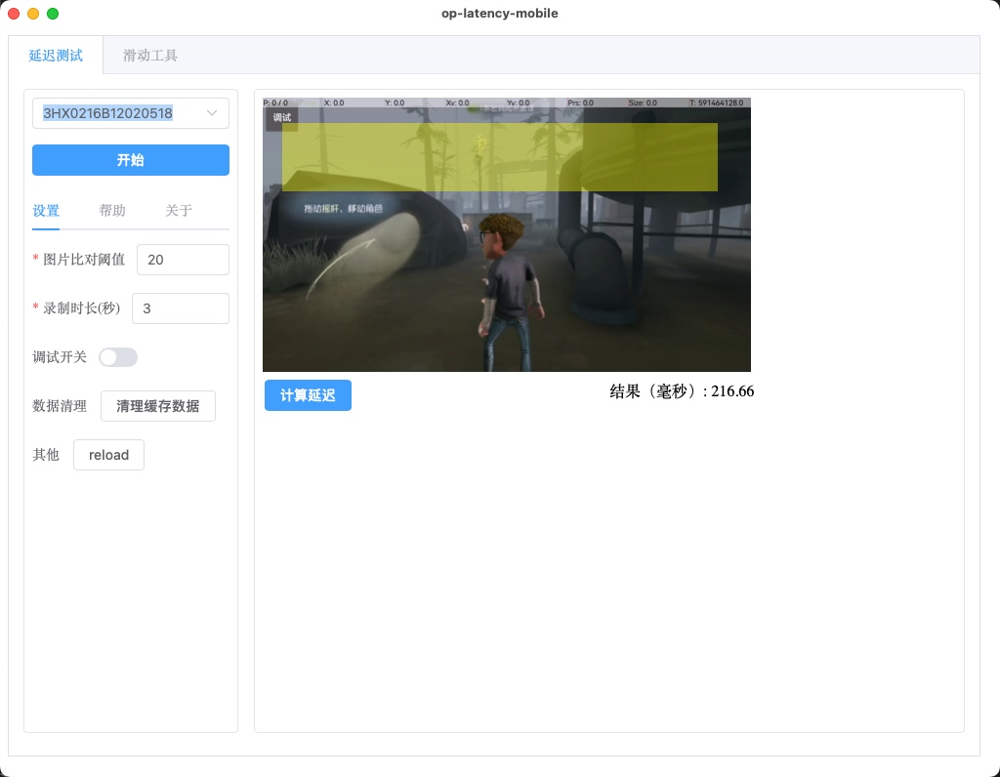
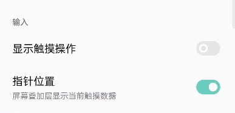
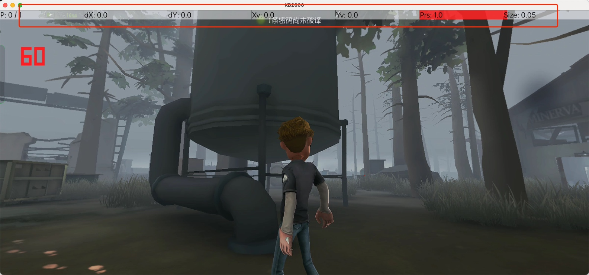
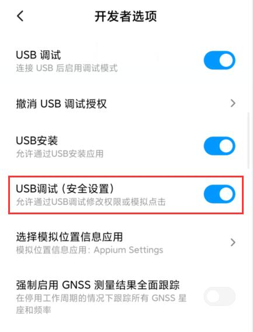

# 移动端延迟测试工具操作及说明文档

## 一、目标

- 支持自动视角拖放
- 支持游戏内延迟数据验证

## 二、操作说明

操作以第五人格为例

准备工作

- 手机已开启开发者模式并正常连接手机
- 开发者选项中"应用>禁止权限监控"已勾选（如无该选项无需关注）

延迟测速

- 打开应用然后选择设备
- 手机打开游戏并运行至指定场景（支持视角切换场景）
- 点击“开始”按钮，此时自动录制并停止
- 结束后会弹出相应预览画面， 此时直接点击图中的“计算延迟”
- 待结果生成即可

## 三、 常见问题

### 3.1 如何开启开发者模式

参考： https://jingyan.baidu.com/article/19192ad8081613a43f570735.html

### 3.2 开启开发者模式后工具上仍然找不到设备

a. 检查手机 USB 连接选项是否为“传输文件”选项， 一般下拉通知栏可查看
b. 重新插拔数据线
c. 在开发者选项页面 去勾选“usb 调试”后重新勾选
d. 在开发者选项页面点击 “撤销 USB 调式授权”
e. 更换数据线

### 3.3 指针位置无法显示

在开发者选项页面，手动勾选“指针位置”

### 3.4 自动操作无效

开发者选项 → USB 调试区域 → USB 调试（安全设置）开关

